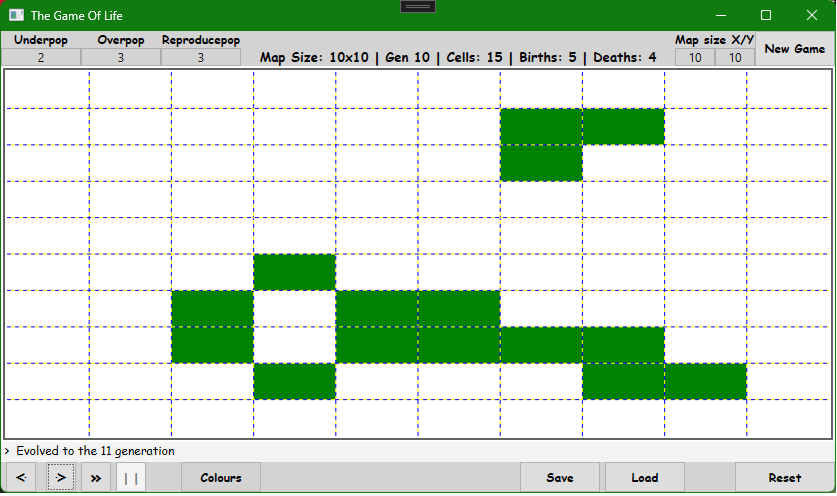

# A task for the first laboratories of Programming .NET Local Applications (06.11.2023)

The project contains a wpf application running Game of Life:
- Changable game map dimensions,
- Possibility to edit the map when the game is running,
- Save/Load the game (with all stats, settings and dimensions) to and from a savefile,
- Validation of the loaded savefile
- One step at a time or run evolutions automatically,
- Possibility to reset the map,
- Possibility to start another game with other map dimensions,
- Possibility to restore previous generations up to 1024 previous generations,
- Statistics of births, deaths and cell alive,
- Game settings can be changed on the fly during the game,
- Restricted/validated inputs,
- Multiple colours game mode to represent births, deaths or alive and dead cells,
- Screenshots of the game map

TODO:
- comments,
- code refactorisation,
- unit tests,
- work on better MVVM

