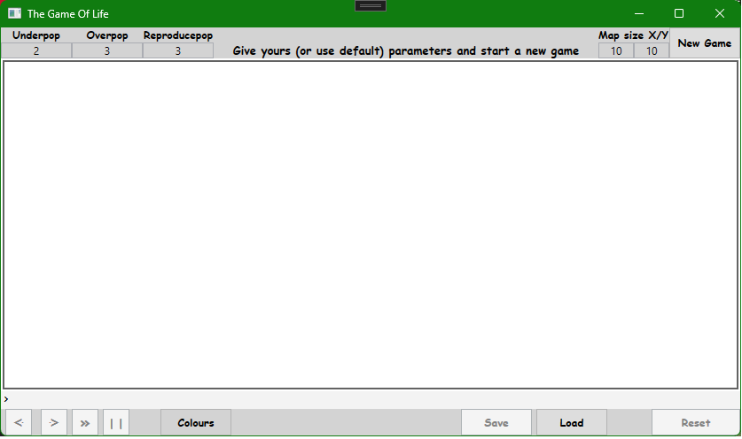
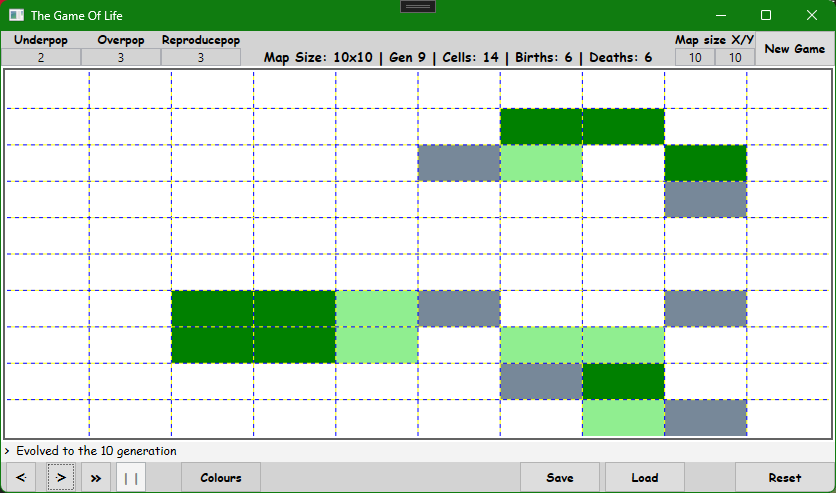

# A task for the first laboratories of Programming .NET Local Applications (06.11.2023)

The project contains a wpf application running Game of Life:
- Changable game map dimensions,
- Possibility to edit the map when the game is running,
- Save/Load the game (with all stats, settings and dimensions) to and from a savefile,
- One step at a time or run evolutions automatically,
- Possibility to reset the map,
- Possibility to start another game with other map dimensions,
- Possibility to "devolve" generations up to the start of the game,
- Statistics of births, deaths and cell alive,
- Game settings can be changed on the fly during the game.

TODO:
- comments,
- code refactorisation,
- unit tests,
- validation of savefiles,
- save current state, not previous one,
- restrict inputs,
- work on better MVVM
- add title

